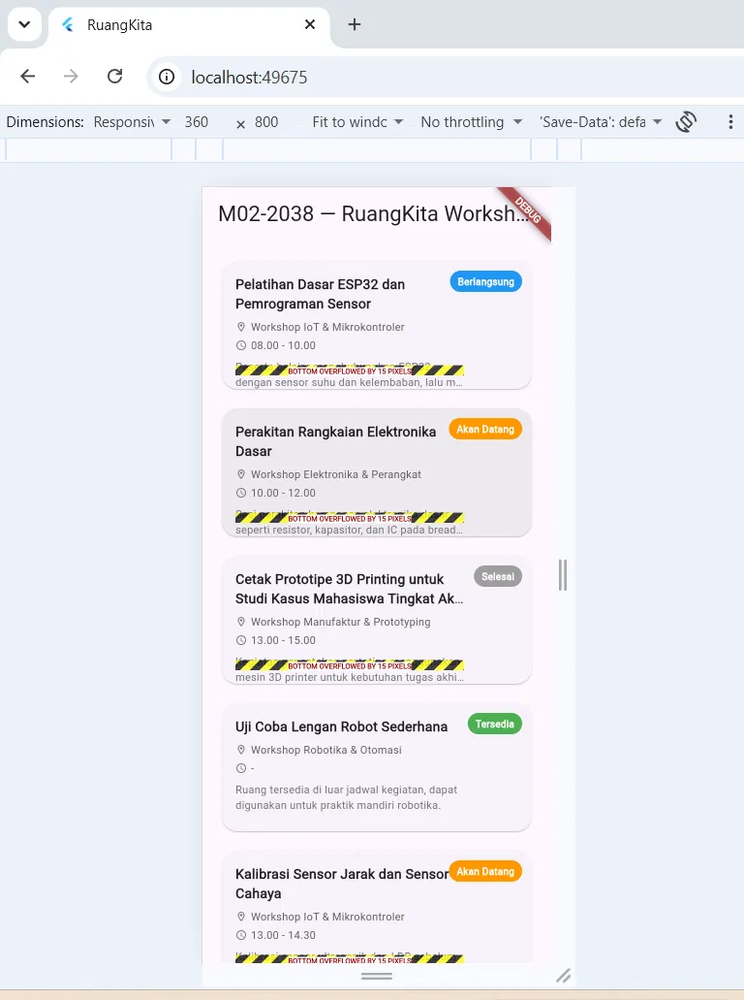
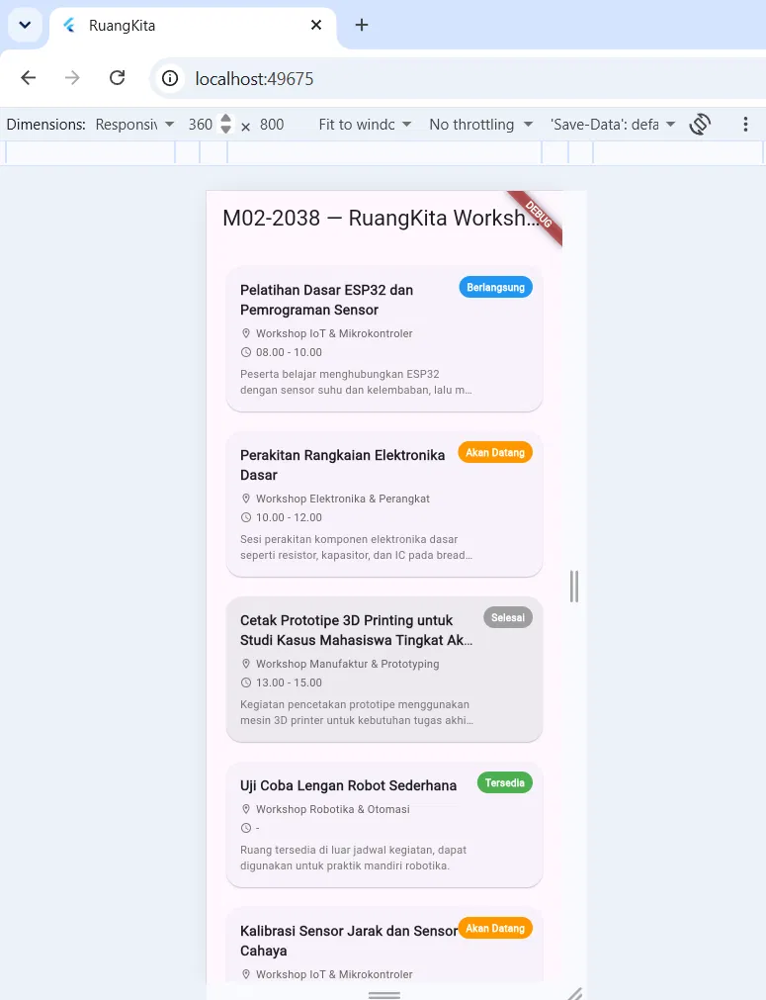
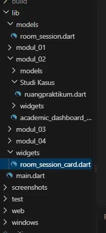

# DEBUG NOTES — Modul 02

## Bug #1 — Bottom Overflow pada Compact Layout

### Waktu Kejadian

Tahap 3, saat pengujian breakpoint Compact dengan ukuran viewport 360×800.

### Gejala

Pada beberapa card muncul pesan:

`BOTTOM OVERFLOWED BY 15 PIXELS`

Masalah terlihat pada card yang memiliki isi teks lebih panjang dibandingkan data lainnya.

### Dugaan Akar Masalah

Tinggi card sebelumnya dipatok tetap menggunakan `SizedBox(height: 140)`. Sementara itu, jumlah baris konten pada setiap card tidak selalu sama. Card dengan judul atau deskripsi yang lebih panjang membutuhkan ruang vertikal lebih besar sehingga isi card tidak muat dalam tinggi 140 pixel.

### Perbaikan yang Dilakukan

Pembatas tinggi tetap pada card dihapus. Tampilan Compact kemudian menggunakan `ListView.separated` sehingga setiap `RoomSessionCard` dapat menentukan tinggi berdasarkan isi kontennya.

Selain itu, teks pada card tetap menggunakan `maxLines` dan `TextOverflow.ellipsis` untuk menjaga teks panjang agar tetap aman.

### Bukti Before

### Bukti After

### Hasil

Setelah perbaikan, pengujian Compact 360×800 tidak lagi menunjukkan bottom overflow. Card dapat mengikuti kebutuhan konten dan daftar dapat di-scroll dengan normal.

---

## Bug #2 — File `ruangpraktikum.dart` dan `ruang_praktikum.dart` Tertukar

### Waktu Kejadian

Saat proses pemindahan dan rename struktur file Modul 02, dari `modul_02` menjadi `modul02`.

### Gejala

Muncul file `ruangpraktikum.dart` tanpa underscore sebagai file untracked. Pada saat yang sama, kode baru yang berisi implementasi `LayoutBuilder` dan Dark Mode tersimpan pada file dengan nama/path yang tidak sesuai.

Akibatnya terdapat dua file yang memiliki nama/path berbeda dan isi kode yang tidak sesuai dengan struktur yang sedang digunakan.

### Dugaan Akar Masalah

Tab file lama di VS Code masih terbuka ketika proses rename dan pemindahan folder dilakukan. Tab lama kemudian menyimpan kembali isi kode ke path lama sehingga membuat file duplikat dengan isi yang tertukar.

### Perbaikan yang Dilakukan

Isi kode dari file yang benar disalin ke lokasi yang seharusnya. File duplikat `ruangpraktikum.dart` kemudian dihapus.

Setelah itu struktur file diverifikasi kembali menggunakan `git status` untuk memastikan hanya file yang benar yang digunakan.

### Bukti Before

Screenshot kondisi sebelum perbaikan tidak tersedia karena pada saat kejadian belum dilakukan dokumentasi screenshot.

### Bukti After

### Hasil

Setelah file duplikat dihapus dan struktur diverifikasi kembali, project menggunakan file `ruang_praktikum.dart` pada lokasi yang benar dan tidak terdapat file duplikat yang digunakan oleh aplikasi.

---

## Catatan Pengujian Tahap 5

Setelah penambahan filter dan Bottom Sheet, aplikasi diuji kembali pada beberapa kondisi:

| Kondisi Pengujian | Hasil |
|---|---|
| Filter + chip aktif, 360×800 Light Mode | Tidak ada overflow |
| Filter + chip aktif, 360×800 Dark Mode | Kontras terbaca dan tidak ada overflow |
| BottomSheet card terpanjang, 1024×800 Light Mode | Modal tetap proporsional |
| BottomSheet card terpanjang, 1024×800 Dark Mode | Kontras teks dan badge tetap terbaca |
| BottomSheet, 720×800 Dark Mode | Tampilan tetap baik |
| List Compact scroll ke bawah, 360×800 Light Mode | Card berikutnya aman dan tidak overflow |

Berdasarkan pengujian tersebut, tidak ditemukan bug baru pada Tahap 5.

## Kesimpulan

Dua masalah yang dicatat dalam dokumen ini merupakan masalah nyata yang muncul selama proses pengembangan Modul 02. Masalah pertama berkaitan dengan layout dan constraints, sedangkan masalah kedua berkaitan dengan pengelolaan file saat proses rename dan pemindahan struktur project.

Setelah dilakukan perbaikan dan pengujian ulang, kedua masalah tersebut sudah diselesaikan.